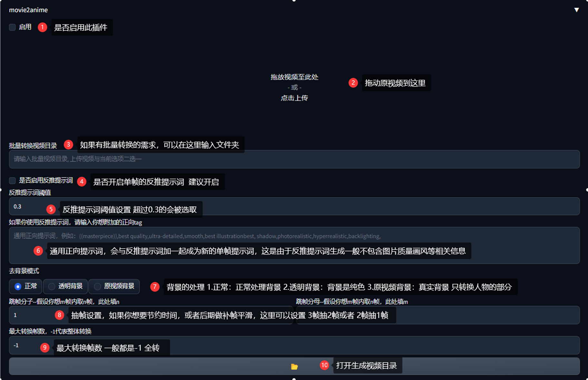

# Video2Anime

Extension for [webui](https://github.com/AUTOMATIC1111/stable-diffusion-webui).

将视频转换为动漫（或者其他风格）视频的插件 ，具体用法如下



# demo


```HTML
<video src="demo/1.mp4" controls="controls" width="500" height="300"></video>
```

# Installation

Install from webui's Extensions tab.

从webui的extensions扩展中安装


